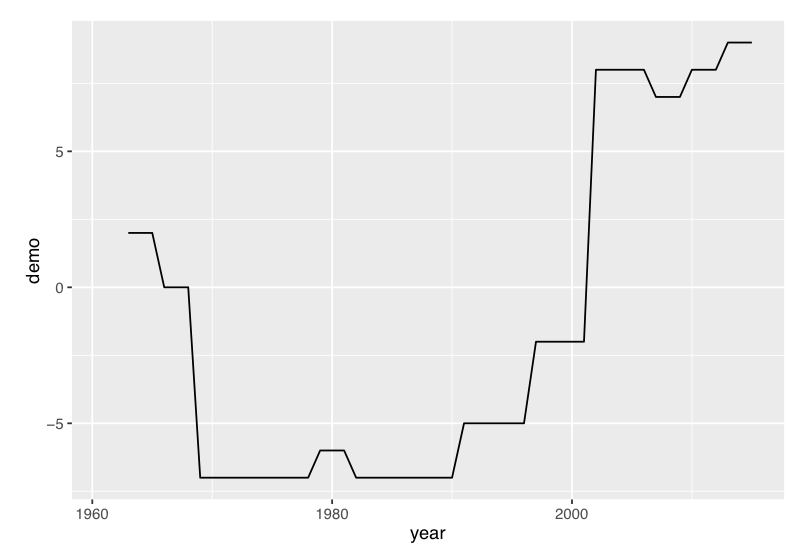
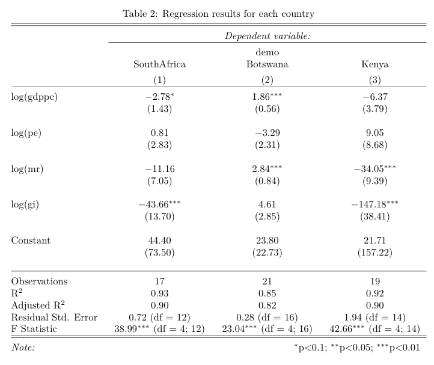
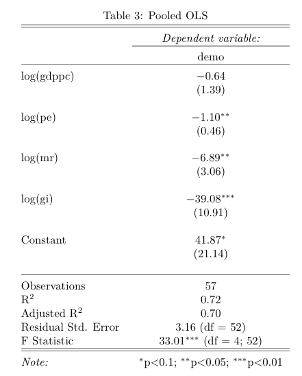
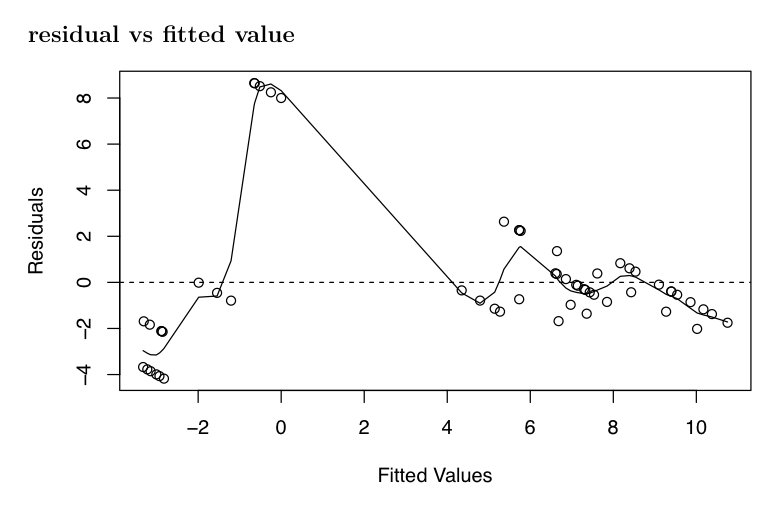
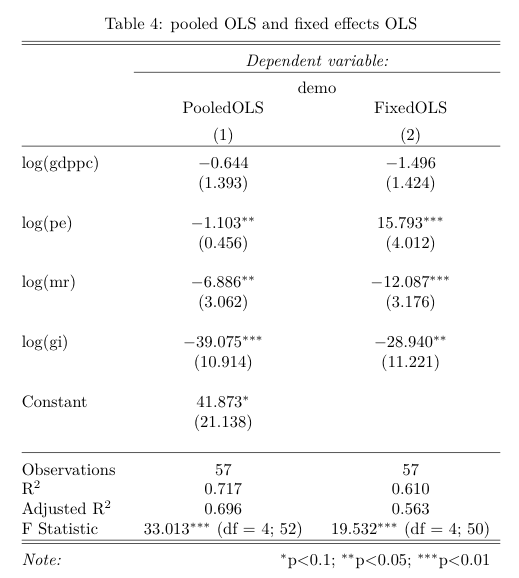

```{r setup, include=FALSE}
knitr::opts_chunk$set(echo = TRUE)
library(ggplot2)
library(stargazer)
library(bibtex)
library(plm)
library(knitr)
```


```{r, include=FALSE}
#importing data
dfsa <- read.csv("SA.csv", header = TRUE, sep = ",")
dfbo <- read.csv("BTW.csv", header = TRUE, sep = ",")
dfkn <- read.csv("KNY.csv", header = TRUE, sep = ",")
dfpanel <- read.csv("panel.csv", header = TRUE, sep = ",")

#runnning regression for each country
L1 <- lm(demo ~ gdppc + pe + mr + gi, data=dfsa)
L2 <- lm(demo ~ gdppc + pe + mr + gi, data=dfbo)
L3 <- lm(demo ~ gdppc + pe + mr + gi, data=dfkn)

#runnning panel regression
L4 <- lm(demo ~ gdppc + pe + mr + gi, data=dfpanel)

#runnning fixed effects panel regression
fixed <- plm(demo ~ gdppc + pe + mr + gi, data=dfpanel, index=c("country", "year"), model="within")

```
## Democracy? Democratization?  

- Democracy: "Ruled by People". A system of government where the citizens exercise power directly or through electing representatives in order to form a parliament.
  *Main Charateristics: Political freedom, Rule of law, Equality before the law, Majority rule, Free and Fair elections. 
- Democratization: A process which leads to a more open, more participatory, less authoritarian soceity within a sovereign state. 


## Background Research 1 - Measuring Democracy

- US-based Freedom House Organization: aggregates scores of 25 indicators from politial rights and civil liberties in order to evaluate the state of freedom
  *2016 Report: Out of 195 states, 125 countries are classified as electoral democracies. 
- The Polity Project: examines qualities of democratic and autocratic authority in governing insitutions to observe a spectrum of governing authority. 

--> We used "Polity Score" data from the Polity Project for our dependent variable  

## Background Research 2 - Democratization in Africa

- Third Wave (1974-1990): Durig the Third Wave of democratization, over 60 countries throughout the world changed their authoritarian regimes to democracies. 
- Repetition of the onset of democratization and frequent slips back to authoritarianism in Africa.
- Making progress towards democracy by improving socioeconomic features and revolting against authoritarian leaders

## Selection of Case countries

- World Economic Forum's Global Competitiveness Report 2015-2016: assess the competitiveness of 140 wolrd economies based on 113 indicators such as macroeconomic environment, health and primary education, goods market and labor market.
- Africa's top performers include Mauritius, South Afirca, Rwanda and Botswana
- Africa's low performers include Liberia, Sierra Leone, Ivory Coast and Ethiopia 

-South Africa (49th), Botswana (71th), Kenya (99th) 

## Research Question and Hypotheses

< What brings democracy? >

- Investigating the effects of various socioeconomic variables on democratization in African countries. 

- Analyzing the correlation between socioeconomic components and democracy. 

 *Three Hypotheses 
 
 1. There is a significant and positive correlation between socioeconomic variables and democracy
 2. Among four socioeconomic components, the educational effect on democracy is the most significant than others.
 3. The degree of impact of variables on democracy is consistent across selected African countries. 


## Democratization level has been changeing over time



## Explanetory variables
|variable name|detail|source|
|:-----|:-----|:------|
|gdppc|Gross Domestic Production Per Capita|World Bank|
|pe|Primary ed enrollment|United Nations|
|mr|Child Mortality under 5|United Nations|
|gi|gender inequality in labor market|United Nations|

## Each country has different significant variables



## All variables except gdppc looks significant


## The coefficients are biased and inefficient.



## The result of Fixed OLS



## Findings

 1. There is a significant and positive correlation between socioeconomic variables and democracy
  - Child Mortality and Primary Education have statistically significant and positive effect on democracy
  - Gender equality has negative effect on democracy
  - GDP is not statistically significant
  
 2. Among four socioeconomic components, the educational effect on democracy is the most significant than others.
  - TRUE
 
 3. The degree of impact of variables on democracy is consistent across selected African countries. 
  - Inconsistent! 